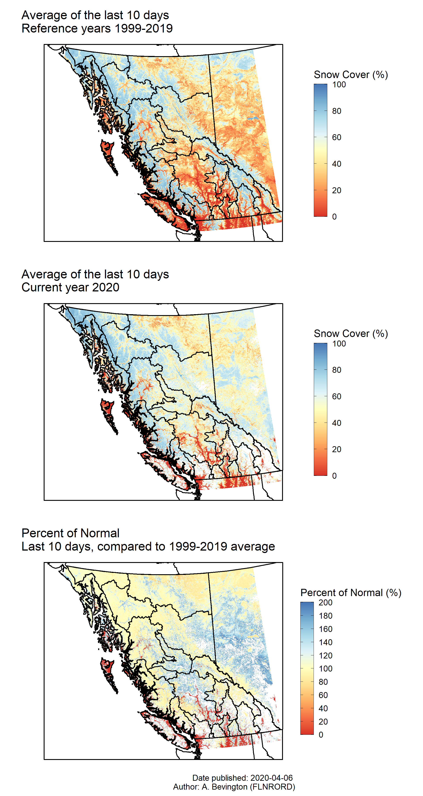

BC MODIS snow cover (% of reference)
============================

### Usage

-   Google Earth Engine (GEE) link to generate average snow cover GeoTiff [https://code.earthengine.google.com/536d9807cf652870ba9264793bf5ebd9]
-   R script to generate plots [R/01_load_and_plot.R]

### Example

<p align="center">
  
</p>

### Project Status

In development / exploration status.

### Getting Help or Reporting an Issue

To report bugs/issues/feature requests, please file an [issue](https://github.com/bcgov/2020_RiverFC/issues/).

### How to Contribute

If you would like to contribute, please see our [CONTRIBUTING](CONTRIBUTING.md) guidelines.

Please note that this project is released with a [Contributor Code of Conduct](CODE_OF_CONDUCT.md). By participating in this project you agree to abide by its terms.

### License

```
Copyright 2020 Province of British Columbia

Licensed under the Apache License, Version 2.0 (the &quot;License&quot;);
you may not use this file except in compliance with the License.
You may obtain a copy of the License at

http://www.apache.org/licenses/LICENSE-2.0

Unless required by applicable law or agreed to in writing, software distributed under the License is distributed on an &quot;AS IS&quot; BASIS,
WITHOUT WARRANTIES OR CONDITIONS OF ANY KIND, either express or implied.
See the License for the specific language governing permissions and limitations under the License.
```
---
*This project was created using the [bcgovr](https://github.com/bcgov/bcgovr) package.* 
